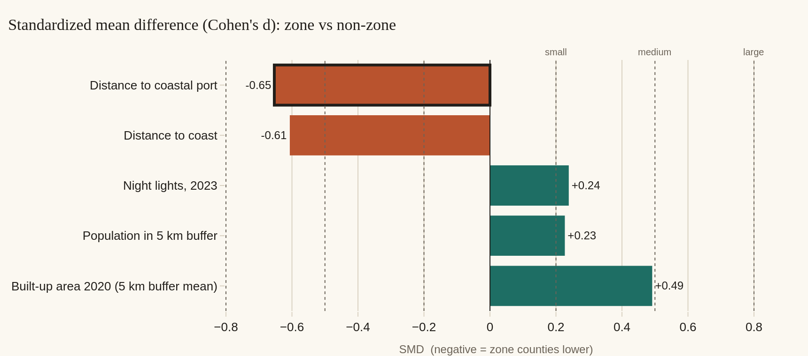
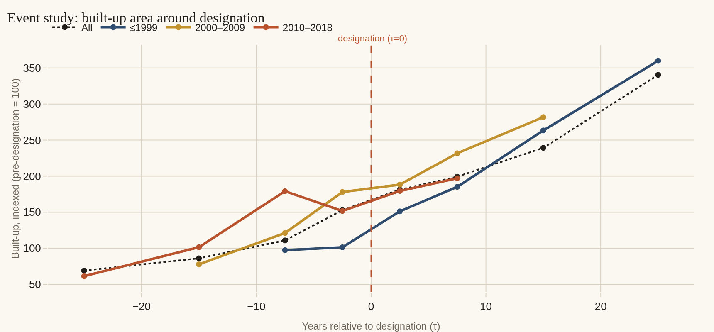
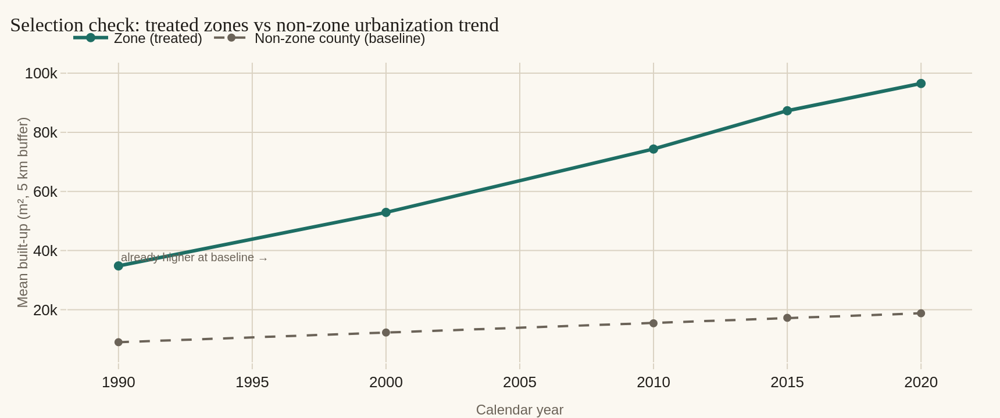

# China's Industrial Development Zones — An Interactive Atlas

**COMP 4433 · Project 2 · Kai Wu**

An *explanatory* Dash application built on a research-grade spatial dataset of
China's nationally and provincially approved industrial development zones. Where
Project 1 was exploratory, this app is purpose-built to answer linked questions
through direct user interaction.

## Background and motivation

**Why this project.** This work is inspired by a comparative policy project on
zoning and the local economy at the **Rocky Mountain Land Use Institute
(RMLUI)**, University of Denver Sturm College of Law, which surveys industrial
zones and industrial parks across multiple jurisdictions worldwide (including
China, Israel, and India). The RMLUI project is framed in qualitative policy
language — describing zone regimes, governance structures, and intended economic
functions through case narratives and comparative description — and, importantly
for this project, it gathers official data points from a range of public
channels. This app approaches the same family of questions — *what gets
designated, where, when, and what changes on the ground afterward* — through
quantitative description and visual analysis of one specific case: China's 2018
NDRC catalog. The intent is **complementary, not substitutive**: where RMLUI's
qualitative framing illuminates *why* and *with what governance logic*, the
quantitative-visual approach here surfaces *how many*, *where exactly*, *under
which compositional structure*, and *with what observable ground-level
signature* — the empirical substrate against which the qualitative readings can
be checked.

**The dataset.** The data is the **2018 inter-ministerial industrial-zone
catalog led by the National Development and Reform Commission (NDRC)** — the
*China Development Zones Review Announcement (2018 edition)* — covering all
officially approved Chinese industrial zones at the national and provincial tier
(**n = 2,543 zones**). It was constructed from the NDRC-led inter-ministerial PDF
release and enriched with spatial covariates derived from buffered satellite
layers: built-up area at five decadal time points (1990–2020), population
density, forest cover, and distance to coast. The unit of observation is one
industrial zone; the dataset is a cross-section with an embedded panel structure
for the satellite-derived variables. It is **not a built-in Seaborn dataset** —
it is a research-grade catalog originally constructed for empirical analysis of
Chinese industrial policy, and the analysis here is framed for a technically
literate audience interested in the geography, composition, and ground-level
outcomes of Chinese zone designation. (For the county-level comparison in Tab 2,
the same zones are spatially joined to GADM v4.1 admin-3 units — see *Data and
provenance* below.)

## The three views

| Tab | Question | Unit | Source file |
|-----|----------|------|-------------|
| **1 · Placement Explorer** | *Where do China's zones go — and why?* | 2,543 zones | `data/enriched.csv` |
| **2 · Zone vs Non-Zone Comparator** | *How do zone-hosting counties differ from the rest?* | 2,420 GADM admin-3 counties | `data/analysis_units.csv` |
| **3 · Designation Event Study** | *Did the ground move after designation — or is it selection?* | 2,543 zones + non-zone baseline | both files |

---

## Preview

Maps render live in the browser; the analytic figures below are static exports
of the app's output (full set in [`images/`](images)).

**Tab 2 — effect chart (reproduces the memo's Table 1 at threshold 1):**



**Tab 3 — event study: built-up area around designation, by cohort:**



**Tab 3 — selection check: treated zones vs the non-zone urbanization baseline:**



---

## Quick start (localhost)

```bash
# 1. (optional) create an isolated environment
python -m venv .venv
source .venv/bin/activate          # Windows: .venv\Scripts\activate

# 2. install dependencies
pip install -r requirements.txt

# 3. run
python app.py

# 4. open the app
#    http://127.0.0.1:8050
```

Now the app reads the two CSVs bundled in `data/`, so there is no data
collection or network step required to run it.

### Or run it as a notebook

The same app is also provided as `China_Industrial_Zones_Atlas.ipynb` (same code,
split into cells with markdown notes). Open it in Jupyter and run all cells; the
final cell renders the app **inline** via Dash's Jupyter integration:

```python
app.run(jupyter_mode="inline", port=8050)   # or "external" / "tab"
```

Use `"external"` to get a clickable localhost link, or `"tab"` to open a browser
tab. Running the notebook needs Jupyter installed (`pip install jupyterlab`); the
app dependencies are the same as above. The notebook is regenerated from `app.py`
by `python build_notebook.py`, so the two never drift.

---

## What each tab does

**Tab 1 — Placement Explorer.** Filter the catalog by province, zone type,
approval level, and approval-year range. The map shades each zone by a covariate
you select (distance to coast, population density, built-up area, forest cover,
or approved area); the histogram overlays that covariate's distribution in *your
selection* against *all zones nationally*, with median reference lines; the
timeline shows approvals per year split by approval level. A live readout
reports the selection size and its median versus the national median. Selecting
only **State Council** zones, for instance, visibly pulls the distribution
toward the coast.

**Tab 2 — Zone vs Non-Zone Comparator.** Set the threshold *k* that defines a
"zone county" (hosts ≥ *k* zones), choose a statistic, and the effect chart
recomputes the gap between zone and non-zone counties on five covariates live.
With **standardized mean difference (Cohen's *d*)**, dotted lines mark the
0.2 / 0.5 / 0.8 small/medium/large thresholds; **teal = zone counties higher,
terracotta = zone counties lower**. The map redraws zone vs non-zone counties as
*k* changes, and the violin plot shows the two groups' distributions for the
highlighted covariate. At *k* = 1 the table reproduces the published memo's
Table 1 exactly (coastal-port SMD ≈ −0.65).

**Tab 3 — Designation Event Study.** Realizes the event-study idea from §3 of
the accompanying memo, using the outcome the catalog's own time points support
*exactly*: built-up area at 1990 / 2000 / 2010 / 2015 / 2020, aligned to each
zone's approval year so τ = 0 is the designation event. The top chart traces
built-up by years-relative-to-designation, by cohort; built-up climbs through
τ = 0 but is **already rising beforehand** — the selection signature. The
"selection check" panel overlays treated zones against the non-zone county
urbanization baseline (treated places sit far higher *already in 1990*), and the
pre/post scatter shows that ~99% of zones grew. Controls: approval cohorts,
zone type, approval level, event-study y-axis normalization (raw / indexed to
pre-designation = 100 / log), and reference-layer toggles.

> **Why built-up and not annual VIIRS here?** The memo's preferred design is a
> county-level event study on the annual VIIRS panel. That needs a per-county
> *first-designation year*, which `analysis_units.csv` does not carry; a
> nearest-centroid reconstruction is only moderately faithful (≈0.58 correlation
> with the true zone count), and — exactly as the memo's limitation (i) notes —
> only ~110 counties have a designation year inside the 2013–2024 VIIRS window.
> Built-up area, available at fixed snapshots for every zone, is the honest
> outcome to expose interactively. The VIIRS county event study remains the
> right next step once the designation-year join is built from the GADM
> polygons.

---

## Project structure

```
.
├── app.py                 # the Dash application (layout, figures, callbacks)
├── China_Industrial_Zones_Atlas.ipynb   # same app as a Jupyter notebook
├── build_notebook.py      # regenerates the notebook from app.py
├── requirements.txt
├── README.md
├── .gitignore
├── assets/
│   └── style.css          # auto-loaded by Dash; editorial "atlas" theme + fonts
├── images/                # static figure exports used in this README
└── data/
    ├── enriched.csv       # 2,543 zones, enriched (zone-level)
    └── analysis_units.csv # 2,420 counties, enriched (county-level)
```

---

## Notes for whoever runs this

- **No API keys or map tokens.** The maps use Plotly's `scatter_geo` (Natural
  Earth base geometry), so they render offline with no Mapbox/Google token.
- **Fonts.** `assets/style.css` pulls *Fraunces* and *Archivo* from Google Fonts
  over the network. With no internet the layout falls back to Georgia/Arial —
  fully functional, just less distinctive.
- **Chinese text.** Zone records carry Chinese province/type names; these are
  mapped to English in `app.py` (`PROVINCE_EN`, `ZONE_TYPE_EN`, `APPROVAL_EN`).
- **Deployment-ready.** `app.py` exposes `server = app.server`, so it can be
  served with `gunicorn app:server` if you ever want to deploy it; deployment is
  not required for this project.
- **Performance.** Both datasets are ~2.5k rows; all callbacks recompute in well
  under a second on a laptop.

---

## Data and provenance

- **Zones.** *China Development Zones Review Announcement (2018 ed.)* — the
  NDRC-led inter-ministerial consolidated catalog. Extracted from the source
  PDF, geocoded via the AMap Web Service API (GCJ-02 → WGS-84), and
  quality-controlled through a four-stage pipeline.
- **County units.** GADM v4.1 admin-3 polygons (centroids; N = 2,420).
- **Covariates.** GHS-BUILT-S R2023A (built-up area), WorldPop 2020 (population),
  EOG VIIRS annual composites (night lights), Natural Earth 1:10m (coast),
  MOT 2004 catalog (ports). All computed on a 5 km buffer.

## Interpretation caveat

This is a **descriptive** tool, not a causal one. Zone placement is endogenous —
authorities select counties on observed and unobserved economic potential — so
the differences shown reflect selection criteria (and possibly subsequent
zone-induced change) without separating the two. The app is designed to make
that distinction legible rather than to hide it.

*Built by Kai Wu. Dataset and methodology documented in the accompanying memo,
"Mapping Chinese Industrial Development Zones: A Spatial Audit and Descriptive
Comparison."*
